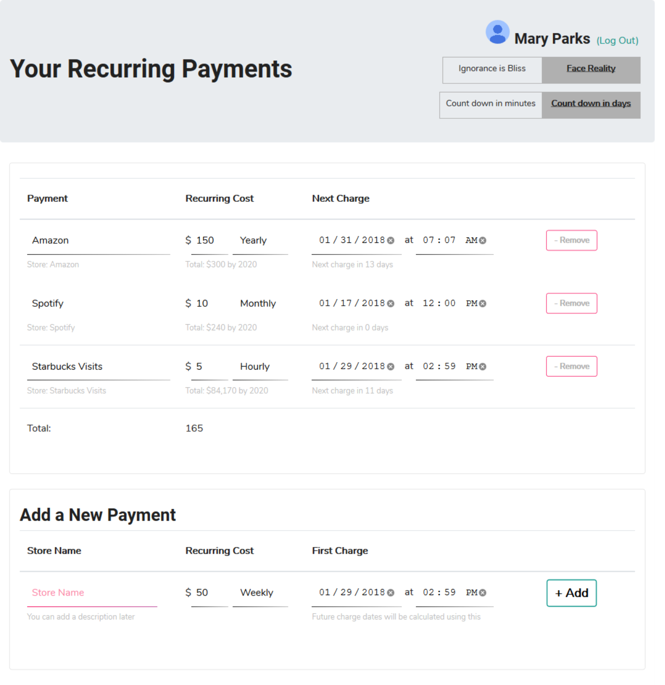
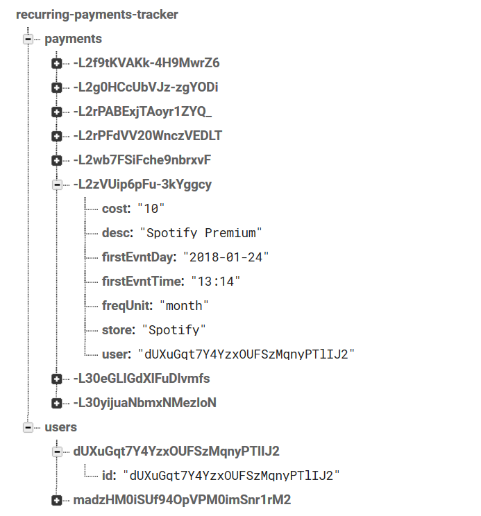

# Payments-Tracker

[Firebase app](https://krosenk729.github.io/Payments-Tracker/) to track your recurring payments (Spotify, Amazon, Mortgage - you name it) as a homework project instead of tracking a train schedule 

Users can enter their upcoming payment and choose if they want to see the total aggregates or not. Payment details can be updated at or removed at any point. $$$$

Tech used: 
- Firebase DB
- Firebase Auth
- Moment.js
- scss

## Screenshot: 
What it looks like once logged in

## Web Storage:
Document storage keeps users in one group and payments tracked in another (index for a payments' user is referenced as a payment document property)

